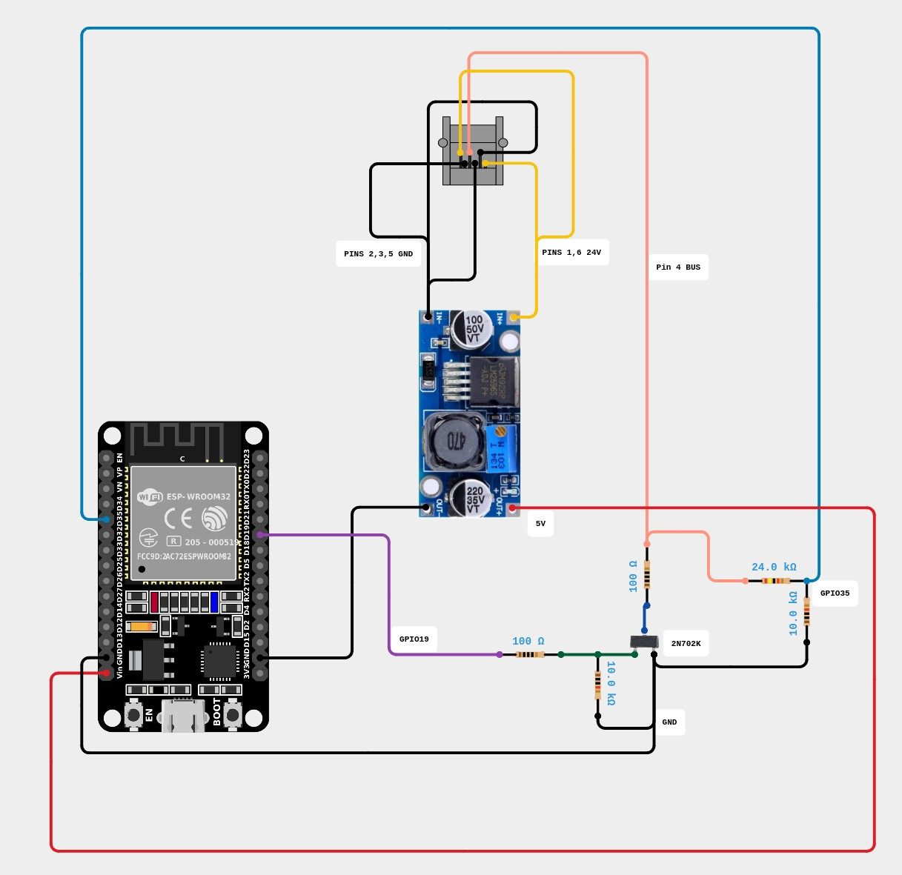

# ESPHome Siemens HVAC Zone Controller Component

An external component for ESPHome that allows you to cleanly interface and control a 6-zone Siemens HVAC zone control system over a custom 9600-baud serial bus.

Unlike traditional implementations that try to "hijack" or act as the main master bus controller, this component acts as a **passive sub-controller (Extra Pad)**. It passively listens to the network to keep Home Assistant updated instantly and mimics secondary keypad button presses only when a state toggle is requested.

## Features

- **True Local Fail-Safe:** If Home Assistant goes offline, your physical wall controller continues to work perfectly without error codes or interruptions.
- **Passive State Syncing:** Automatically monitors the active system mask broadcast by the Master panel to update your Home Assistant entities instantly.
- **Zero Bus Contention:** Does not blast persistent heartbeat loops; only writes to the UART lines during a physical or virtual toggle event.
- **Native ESPHome Entities:** Exposes the zones as clean, individual `switch` entities without requiring complex YAML lambdas.

---

## Using the Siemens HVAC Zone Controller Component

To integrate this component into your ESPHome node, you will need to reference this GitHub repository as an external source, configure your UART bus, and define your zone entities.

---
### 1. Hardware Connections

The Siemens Bus is a single wire bus that is pulled up to 12V. The RJ45 pinout of the User Panel is as follows:

| Pin | Function |
|-----|----------|
| 1   | 24V      |
| 2   | Ground   |
| 3   | Ground   |
| 4   | BUS      |
| 5   | Ground   |
| 6   | 24V      |

ESP Connection schematic:



### 2. Quick Start YAML Template

Copy and paste this configuration profile into your device's configuration file (`.yaml`). Replace `YOUR_GITHUB_USERNAME` with your actual GitHub username.

```yaml
# ---------------------------------------------------------
# 1. Pull the Custom Component from GitHub
# ---------------------------------------------------------
external_components:
  - source:
      type: git
      url: [https://github.com/milGus/esphome-siemens-hvac-zone-controller](https://github.com/milGus/esphome-siemens-hvac-zone-controller)
    components: [ siemens_hvac_zone_controller ]

# ---------------------------------------------------------
# 2. Configure Hardware Serial Communication (UART)
# ---------------------------------------------------------
uart:
  id: bus_uart
  rx_pin: GPIO35
  tx_pin: 
    number: GPIO19
    inverted: true
  baud_rate: 9600

# ---------------------------------------------------------
# 3. Instantiate the Core Component Hub
# ---------------------------------------------------------
siemens_hvac_zone_controller:
  id: siemens_hub
  uart_id: bus_uart

# ---------------------------------------------------------
# 4. Map the Zone Valves to Home Assistant Toggles
# ---------------------------------------------------------
valve:
  - platform: siemens_hvac_zone_controller
    name: "Zone 1"
    siemens_hvac_zone_controller_id: siemens_hub
    zone_number: 1

  - platform: siemens_hvac_zone_controller
    name: "Zone 2"
    siemens_hvac_zone_controller_id: siemens_hub
    zone_number: 2

  - platform: siemens_hvac_zone_controller
    name: "Zone 3"
    siemens_hvac_zone_controller_id: siemens_hub
    zone_number: 3

  - platform: siemens_hvac_zone_controller
    name: "Zone 4"
    siemens_hvac_zone_controller_id: siemens_hub
    zone_number: 4

  - platform: siemens_hvac_zone_controller
    name: "Zone 5"
    siemens_hvac_zone_controller_id: siemens_hub
    zone_number: 5

  - platform: siemens_hvac_zone_controller
    name: "Zone 6"
    siemens_hvac_zone_controller_id: siemens_hub
    zone_number: 6
